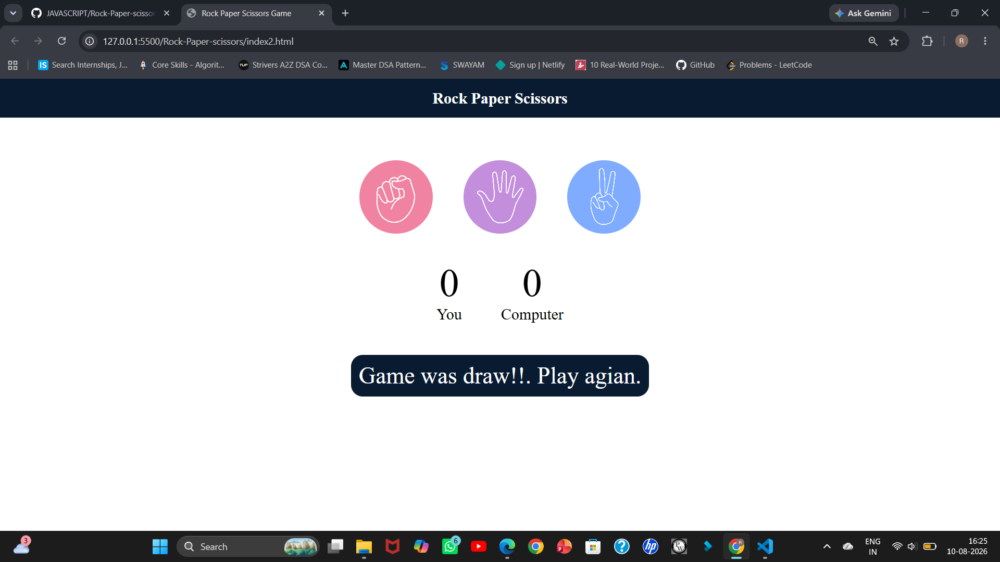
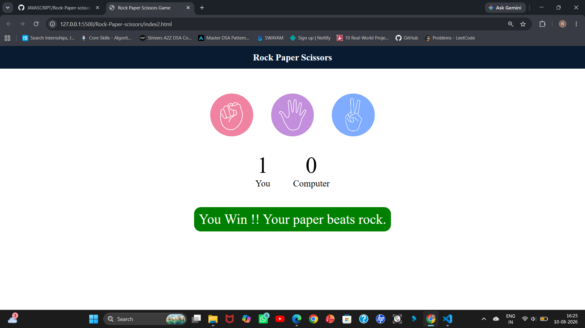
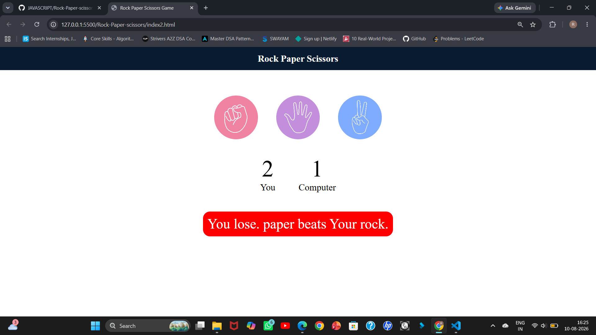

# ✊ Rock Paper Scissors Game

A simple and interactive **Rock Paper Scissors** game built using **HTML, CSS, and JavaScript**.
The player competes against the computer, and the game determines the winner based on the selected choices.

## 🎮 Features

* 🪨 Rock, 📄 Paper, and ✂️ Scissors choices
* 🤖 Computer-generated random choice
* 🏆 Automatic winner detection
* 📊 Displays player and computer scores
* 🔄 Interactive gameplay
* 🎨 Simple and clean user interface
* 📱 Responsive design

## 🛠️ Technologies Used

* **HTML** – Structure of the game
* **CSS** – Styling and layout
* **JavaScript** – Game logic, computer choice, winner detection, and score tracking

## 📂 Project Structure

```text
Rock-Paper-Scissors/
│
├── index.html
├── style.css
├── app.js
├── images/
│   └── ...
└── README.md
```

## 🎯 How to Play

1. Choose **Rock**, **Paper**, or **Scissors**.
2. The computer randomly selects one of the three choices.
3. The game compares both choices.
4. The winner is displayed on the screen.
5. The score is updated after each round.

### 🏆 Game Rules

| Player      | Computer    | Result      |
| ----------- | ----------- | ----------- |
| Rock        | Scissors    | Player Wins |
| Paper       | Rock        | Player Wins |
| Scissors    | Paper       | Player Wins |
| Same Choice | Same Choice | Draw        |

## 📸 Screenshot

Add your game screenshot inside the `screenshots` folder and use:

```markdown



```

## 🚀 Future Improvements

* Add sound effects
* Add difficulty levels
* Add animations
* Add a reset score button
* Add multiplayer functionality

## 👩‍💻 Author

**Rutuja Jadhav**

---

⭐ If you like this project, feel free to star the repository!
