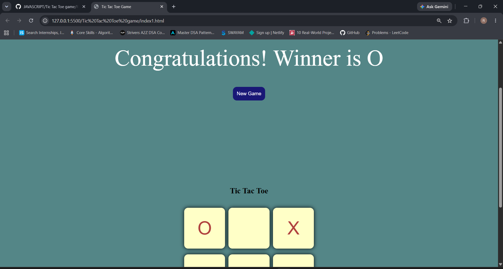
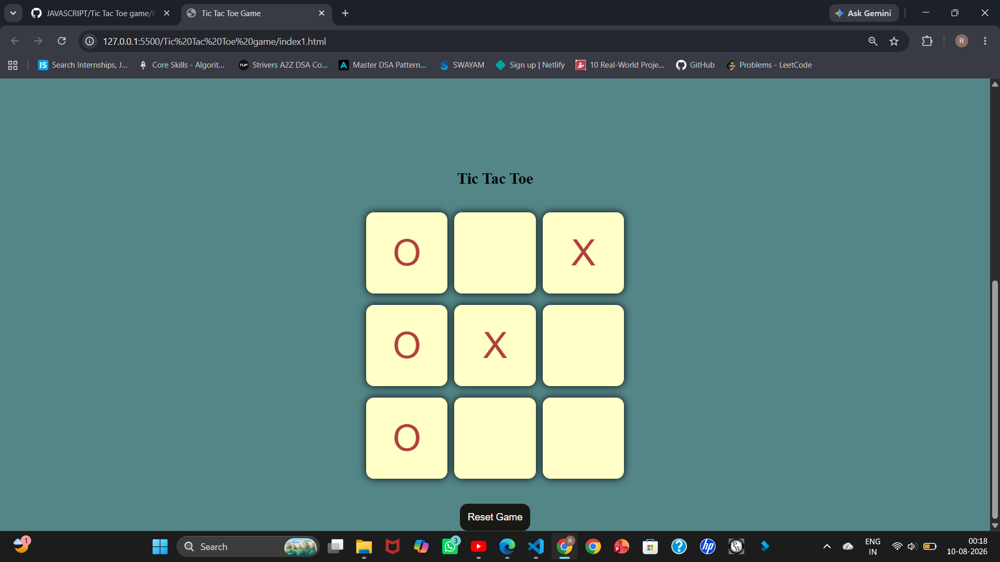

###Tic Tac Toe Game

A simple and interactive Tic Tac Toe game built using HTML, CSS, and JavaScript.
The game allows two players to play against each other, automatically detects the winner, and provides an option to start a new game.

## Features
👥 Two-player gameplay
🏆 Automatic winner detection
🔄 New Game / Reset functionality
🎨 Simple and clean user interface
⚡ Interactive gameplay using JavaScript

## Technologies Used
HTML – Used to create the structure of the game
CSS – Used for styling and designing the game interface
JavaScript – Used to implement game logic, player turns, and winner detection

# How to Play:
- Player O starts the game.
- Players take turns placing O and X on the board.
- The game checks the winning combinations after each move.
- When a player gets three matching symbols in a row, column, or diagonal, they win.
   Click New Game to start a new game.

  
## Project Structure
Tic-Tac-Toe/
│
├── index.html
├── style.css
├── app.js
├── screenshots/
│   └── tic-tac-toe.png
└── README.md
##Screenshot

